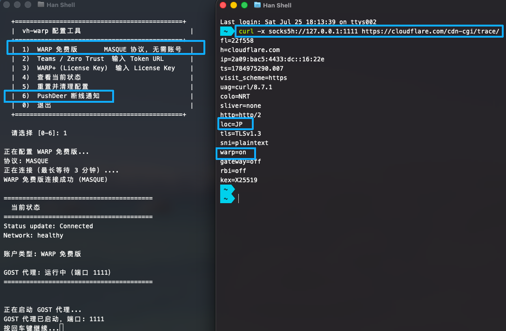

# 🥝 vh-warp

> 基于 Cloudflare WARP 的轻量级 Docker 镜像，一键部署隐私保护 + 网络加速服务，支持 Free / Plus / Teams 全账号类型。

[](https://hub.docker.com/r/uxiaohan/vh-warp)

## ✨ 特性

- 🚀 **一键部署** — Docker Compose 一行命令启动，零配置上手
- 🔒 **隐私保护** — Cloudflare WARP 加密隧道，隐藏真实 IP，防止追踪
- ⚡ **网络加速** — WARP 全球边缘网络，降低延迟，提升连接体验
- 🔄 **双协议代理** — Mixed SOCKS5 + HTTP，单端口 1111 自动识别协议
- 👤 **多账号支持** — WARP Free / WARP+ (License Key) / Teams (Zero Trust)
- 💓 **断线自愈** — 内置心跳检测，四级渐进式自动恢复链路
- 🔔 **即时通知** — 可选 PushDeer 推送，断线、恢复、急救实时报信
- 🎮 **交互菜单** — `vhwarp` 配置工具，全菜单操作，新手友好
- 🖥️ **多架构适配** — amd64 / arm64，服务器、软路由、树莓派均可运行
- 📏 **日志可控** — 自动轮转保留最新 3MB，适合低内存环境

## 🚀 快速开始

### 🐳 直接拉取（推荐）

```bash
# 下载 docker-compose.yml
wget https://raw.githubusercontent.com/uxiaohan/vh-warp/main/docker-compose.yml
# 启动
docker compose up -d
```

### 🔨 本地构建

```bash
git clone https://github.com/uxiaohan/vh-warp.git
cd vh-warp
docker compose -f docker-compose.build.yml build
docker compose -f docker-compose.build.yml up -d
```

## ⚙️ 配置

```bash
docker exec -it vh-warp vhwarp
```

```
  ██╗   ██╗██╗  ██╗       ██╗    ██╗ █████╗ ██████╗ ██████╗
  ██║   ██║██║  ██║       ██║    ██║██╔══██╗██╔══██╗██╔══██╗
  ██║   ██║███████║       ██║ █╗ ██║███████║██████╔╝██████╔╝
  ╚██╗ ██╔╝██╔══██║       ██║███╗██║██╔══██║██╔══██╗██╔═══╝
   ╚████╔╝ ██║  ██║       ╚███╔███╔╝██║  ██║██║  ██║██║
    ╚═══╝  ╚═╝  ╚═╝        ╚══╝╚══╝ ╚═╝  ╚═╝╚═╝  ╚═╝╚═╝
  ─────────────────────────────────────────────────────────
    ☁️  Cloudflare WARP 隐私保护 · 网络加速
  ─────────────────────────────────────────────────────────

  +==============================================+
  |              vh-warp 配置工具                |
  +==============================================+
  |  1)  WARP 免费版       MASQUE 协议，无需账号  |
  |  2)  Teams / Zero Trust  输入 Token URL       |
  |  3)  WARP+ (License Key)  输入 License Key    |
  |  4)  查看当前状态                             |
  |  5)  重置并清理配置                           |
  |  6)  PushDeer 断线通知                        |
  |  0)  退出                                    |
  +==============================================+

  请选择 [0-6]:
```



## 🌐 使用代理

局域网设备配置代理地址即可：

```
SOCKS5:  192.168.x.x:1111
HTTP:    192.168.x.x:1111
```

> 端口 1111 为 Mixed 模式，同一端口同时支持 HTTP 和 SOCKS5，客户端无需区分协议类型。

## 💓 心跳检测与自愈

容器内置断线自愈守护进程，后台持续检测 `warp=on`，自动化恢复整条链路：

| 🔁 连续失败 | 🛠️ 动作 | 📢 PushDeer 通知 |
|:---:|------|------|
| 1 | 📝 记录日志 | 🟡 "WARP 打了个盹..." |
| 3 | 🔄 软重连 `disconnect → connect` | 💉 "正在给 WARP 做心肺复苏..." |
| 6 | 🔧 重启 SOCKS5/HTTP 代理层 | 🟠 "重启 WARP 代理层..." |
| 9 | 💥 完整重置 `delete → 需手工重配` | 🚨 "SOS！WARP 离线！" |

完整重置后，每小时提醒一次（最多 3 次 ⏰）。当你重新配置好 WARP 后，会自动退出急救模式并恢复监控 🎉

## 🔔 PushDeer 通知

进入配置菜单 **6) PushDeer 断线通知** 设置 PushKey：

1. 📲 安装 [PushDeer App](https://www.pushdeer.com/)
2. 🔑 在 App 中获取 PushKey
3. 📝 在 vhwarp 中输入 PushKey，自动发送测试通知确认

配置后，所有断线、重连、急救、恢复事件均实时推送到你手机 📱

## 📋 日志

日志保存在 `/var/log/warp-gost/`，单文件上限 3MB 自动截断：

| 📄 文件 | 📝 内容 |
|------|------|
| `warp-svc.log` | Cloudflare WARP 服务日志 |
| `gost.log` | GOST 代理服务日志 |
| `health-check.log` | 💓 心跳检测日志 |
| `vhwarp.log` | ⚙️ 配置工具操作日志 |
| `entrypoint.log` | 🚀 容器启动日志 |

```bash
# 实时查看健康检测日志
docker exec -it vh-warp tail -f /var/log/warp-gost/health-check.log
```

## 📦 Docker Run

```bash
docker run -d \
  --restart=always \
  --name vh-warp \
  --cap-add=NET_ADMIN \
  --cap-add=NET_RAW \
  --cap-add=SYS_MODULE \
  --cap-add=MKNOD \
  --device-cgroup-rule="c 10:200 rwm" \
  -p 1111:1111 \
  --sysctl net.ipv4.conf.all.src_valid_mark=1 \
  --sysctl net.ipv4.ip_forward=1 \
  --sysctl net.core.somaxconn=65535 \
  -v warp-data:/var/lib/cloudflare-warp \
  uxiaohan/vh-warp:latest
```

## 🩺 故障排查

```bash
# 查看 WARP 连接状态
docker exec -it vh-warp warp-cli status

# 查看心跳检测历史
docker exec -it vh-warp cat /var/log/warp-gost/health-check.log

# 重置所有配置并重新来过
docker exec -it vh-warp vhwarp
# → 选择 "5) 重置并清理配置"
```

---

## ☕ 捐赠支持

如果这个项目对你有帮助，欢迎请我喝杯咖啡～


> 感谢每一位 Sponsor，你的支持是我持续维护的动力 💪

---

## ⚠️ 免责声明

本项目仅供学习与技术研究使用。使用者应遵守所在国家/地区的法律法规，不得将此工具用于任何非法用途。项目作者不承担任何因使用本工具而产生的法律责任。

## 📜 License

MIT
